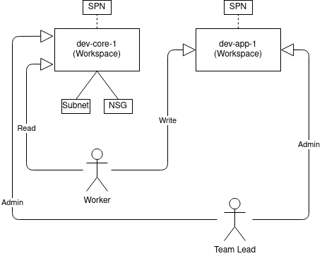
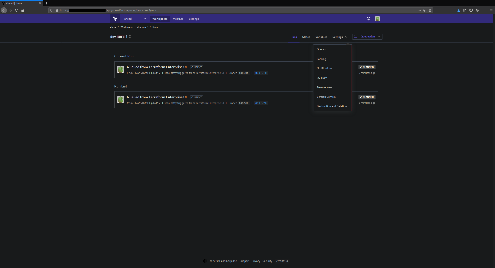
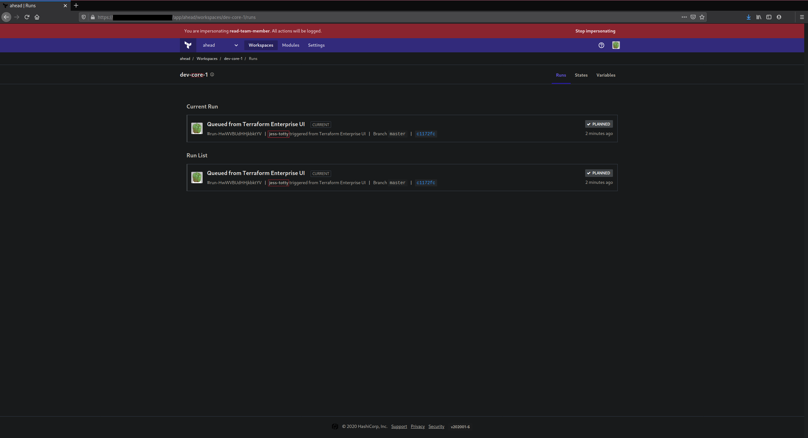
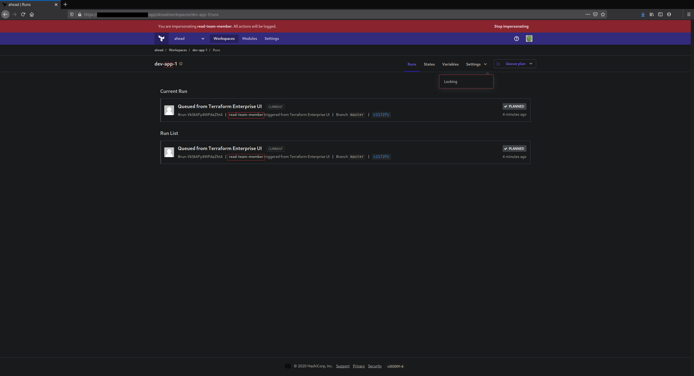

# Overview

This documentation is an overview on the different levels of workspace access for teams within Terraform Enterprise.

## Demo Environment

Below is a graphical representation of the demo environment's configuration for workspaces and team access:

where the "Worker" is synonymous to a developer and the "Team Lead" is synonymous to a manager of development.

The "Worker" has __write__ access to the `dev-app-1` workspace and __read__ access to the `dev-core-1` workspace. The "Team Lead" has __admin__ access to both the `dev-app-1` and `dev-core-1` workspaces.  

## Explanation of Workspace Settings

Each workspace has configurable settings with visibility that is dependent on the team's (or user's) level of access.

### General

This setting controls basic configuration such as ID, workspace name, execution mode, apply method, terraform version, and terraform working directory.

### Locking

This setting controls temporarily preventing new `terraform plan` and `terraform apply`.

### Notifications

This setting controls configuration for integrating notifications to other applications (such as Slack) based on Run events.

### SSH Key

This setting controls configurations for downloading Terraform modules from Git-based module sources.

### Team Access

This setting controls the workspace's permissions.

### Version Control

This setting controls the workspace's VCS connection.

### Destruction and Deletion

This setting controls removing the workspace and it's supporting infrastructure.

## Admin Access

Below is the graphical view for the "Team Lead" within the `dev-core-1` workspace with __admin__ access:

### Run, States, Variables, Queue Plans

__Admin__ access grants interaction with these tabs:

* view runs
* view state file
* write variables
* queue plans

### Workspace Settings

* General
* Locking
* Notifications
* SSH Key
* Team Access
* Version Control
* Destruction and Deletion

## Read Access

Below is the graphical view for the "Worker" within the `dev-core-1` workspace with __read__ access:

### Run, States, Variables, Queue Plans

__Read__ access grants interaction with these tabs:

* view runs
* view state file
* read (not write) non-sensitive variables
* can't queue plans

### Workspace Settings

None

## Write Access

Below is the graphical view for the "Worker" within the `dev-app-1` workspace with __write__ access:

### Run, States, Variables, Queue Plans

__Write__ access grants interaction with these tabs:

* view runs
* view state file
* write variables
* queue plans

### Workspace Settings

* Locking
